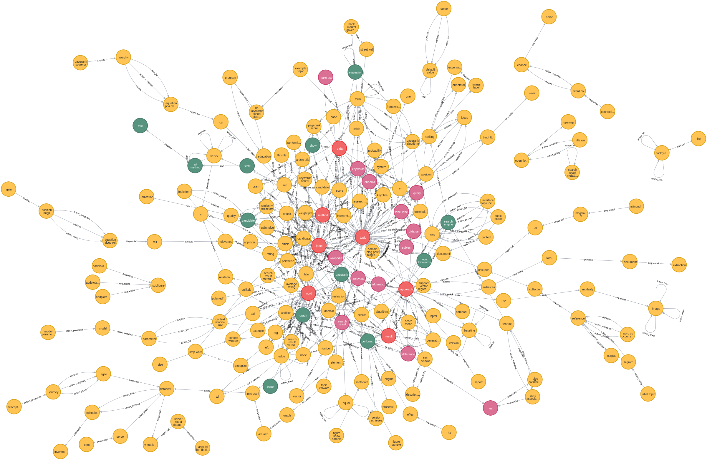
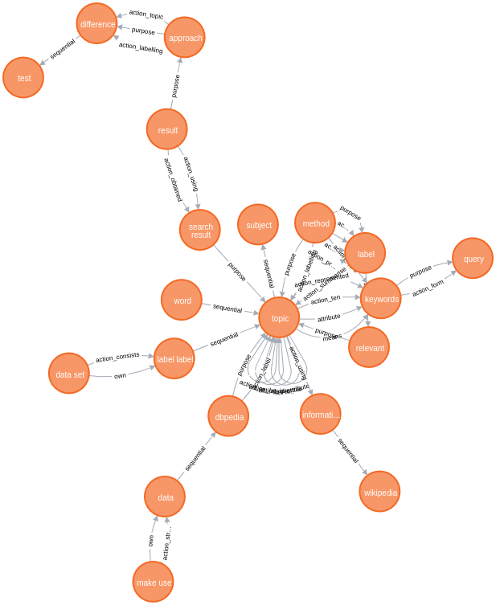

# SLN-Summarization
A summarization algorithm based Semantic Link Network.

### Method and Files

* code/corpus.py
    - all corpus file
    - `config.ini` is used to config the dataset path

* code/eval_metric.py
    - ROUGE-1.5.5 toolkit
    - `rouge_perl` method

* code/psumm.py
    - Summarizer().summarize_item() is compared approaches

* notes/Structure_Analysis
    - Show the distribution of words in different corpus

* notes/SLN-new
    - Our approach and evaluation
    - `summ_item` method

### Evaluation

| System      | ACL2014                  | Legal                | CNN                       |
|    -        |                        - | -                    | -                         |
|First        | 28.37/4.98/17.99         | 23.86/**6.66**/12.84 | 24.3/10.09/21.43          |
|TextRank     | 32.55/**9.27**/**22.53** | 21.95/5.66/**13.47** | 28.26/9.4/24.38           |
|LexRank      | 33.03/8.66/16.17         | 22.72/5.79/13.1      | 26.5/9.1/21.76            |
|LSA          | 32.35/5.87/15.94         | 12.49/2.31/7.37      | 26.36/6.74/20.97          |
|KL           | 30.95/5.55/17.09         | 14.72/3.75/9.31      | 25.82/7.71/22.04          |
|Reinforce    | 32.81/-/-                | -                    | -                         |
|**Ours**     | **34.42**/8.33/21.73     | **25.67**/6.39/**14.49** | **30.57**/**10.35**/**25.06** |


### Graph

* From `P14-2103.xhtml`

* Full SLN


* Summary SLN



### Analysis

原文1616个词，生成摘要有10句/108词，标准摘要有82词。
原文包含：197节点、510个语义链。
摘要的SLN包含20个节点、42个语义链。

#### 1. 词分析

- 重合的词都是比较重要的词，按分布看是比较重要的词或是度数较高的词

| 词 | 引言次数 | 中间次数 | 结论次数 | 备注 |
| -- | -- | -- | -- | -- |
| approach | 5 | 6 | 1 | |
| topic | 16 | 17 | 2 | 度数很高，在图中看是核心词汇 |
| method | 5 | 4 | 3 | 评分0.88，很重要 |
| label | 9 | 25 | 2 | 评分0.6，但是度数高，容易被其他句子连带选中。一部分label作为动词在link中 |
| topic | 16 | 17 | 2 | |

- 未重合词：

| 词 | 引言次数 | 中间次数 | 结论次数 | 备注 |
| -- | -- | -- | -- | -- |
| performance | 1 | 5 | 0 | 显著性不够好，频率低 |
| state | 0 | 0 | 1 | 只在Conclusion出现一次 |
| engine | 1 | 1 | 1 | |
| search engine | 1 | 1 | 1 | search及短语search result被选中，engine重要度不足|
| topic keywords | 1 | 1 | 1 | 两个词都分别出现在摘要中，但是合起来的名词短语组合度较低。 |


#### 2. 生成SLN分析

108词包含20个节点、42个关系，说明多样性好，重复性冗余少。
生成的SLN是一个完整的图，说明句子之间主题连贯。


#### 3. 词选中的原因

词是否被选中与所在句子的整体质量也有关系，出现频率越高的词，即使不重要，但是整句被选中后，也会被加入到摘要中。

### TODO

* 12月8日工作
    1. sln_constructor.py 中把代词识别出来成为Node
    2. 修复bug，link作为开头的情形
    3. 合并make_sln_noun_xxxx，抽取公共函数，用candidate_link_names控制哪些链接可以引入
        * action, passive, negative, co-occur, attribute, temporal作为基本的链接，永远都要生成
    - [x] 修改test，抽取成code_v3，按照youdao note的目录写一个
    5. 引入推理规则
    6. 周三生成neo4j的图片，多层次，是否带推理

### Evaluation Step 2

12-4
```
paper-corpus: 173it [00:00, 3153.83it/s]
100%|███████████████████████████████████████████████████████████████████████████████████████████████████████████████████████████████████████████████████████████████████████████████████████████| 10/10 [00:08<00:00,  1.13it/s] 
{'rouge-1': {'f': 1.5882692252362154, 'p': 1.0788148452084019, 'r': 3.258856198524567}, 'rouge-2': {'f': 0.28696807395630536, 'p': 0.20030762449525424, 'r': 0.5523677914975701}, 'rouge-l': {'f': 1.6659821852355423, 'p': 1.2432469158592727, 'r': 2.716295283382609}} 9
paper-corpus: 173it [00:00, 2845.16it/s]
100%|███████████████████████████████████████████████████████████████████████████████████████████████████████████████████████████████████████████████████████████████████████████████████████████| 10/10 [00:20<00:00,  2.07s/it] 
{'rouge-1': {'f': 1.3748283895955316, 'p': 0.9332229929408208, 'r': 2.824372020724842}, 'rouge-2': {'f': 0.1892139366430468, 'p': 0.1305372794984323, 'r': 0.3730502284747524}, 'rouge-l': {'f': 1.3925806625590027, 'p': 1.0105235053068644, 'r': 2.3262352110201685}} 9
```
